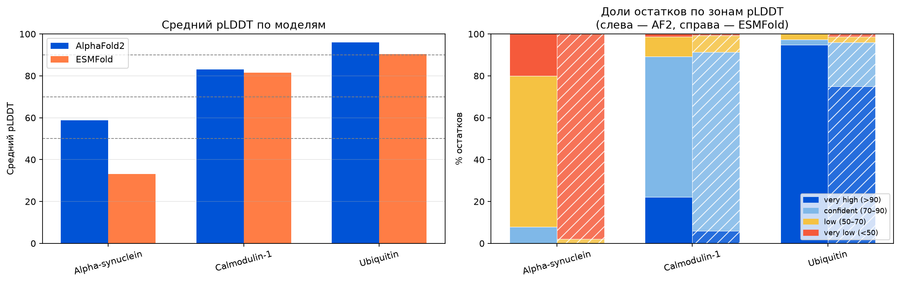
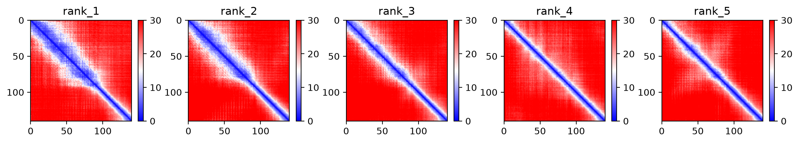
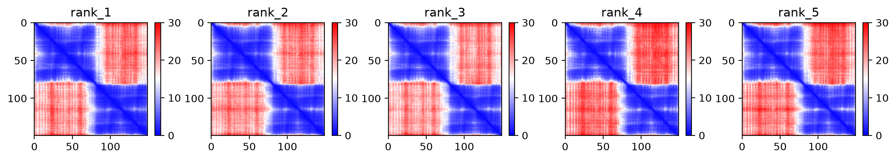
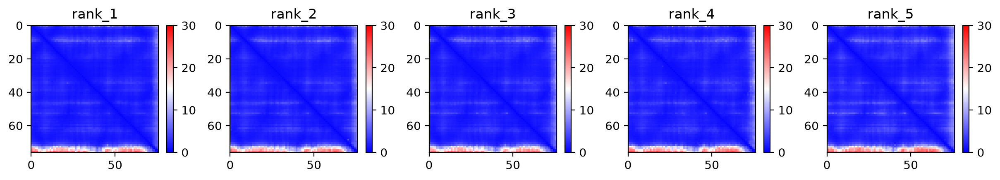

Рассматриваемые белки:
- Alpha-synuclein: полностью неупорядоченный, подвижный белок
- Calmodulin-1: два жестких домена, соединенных линкером
- Ubiquitin: стабильное жесткое тело



Значительные отличия в среднем pLDDT наблюдается только на Alpha-synuclein






Понятная ситуация на нестабильном Alpha-synuclein и стабильном Ubiquitin.

Не могу интерпретировать картинку для Calmodulin-1, но она как раз намекает на что-то среднее между стабильным и нестабильным. Но про

# Запуск alphafold2

```bash
cd alphafold2
uv sync
uv run colabfold_batch input_seqs.fasta out/

```

# Запуск esmfold
```bash
cd esmfold
uv sync
uv run esmfold.py
```
